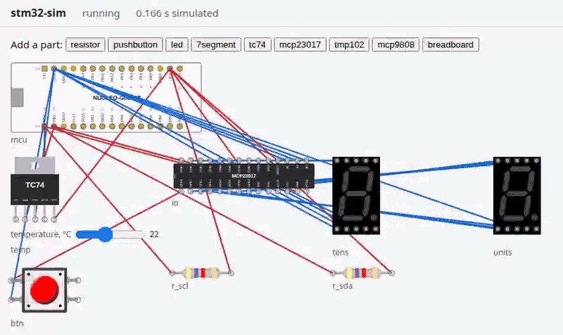

# stm32-sim

A simulator for an STM32 microcontroller on a virtual breadboard that runs on your
own machine, offline, with no account. It runs the real `.elf` that
`arm-none-eabi-gcc` builds from your register-level C, the same file you would
flash to a NUCLEO-G031K8, against the parts you wire to it: LEDs, buttons,
7-segment digits, I2C sensors, an I/O expander. Like the real chip, it fails
silently: a GPIO write with the port's clock off does nothing, and an I2C bus
without pull-ups never starts. Then it explains: diagnostics name the line that
made the mistake and say what went wrong.



_The thermometer example (`firmware/thermometer/`): a TC74 temperature sensor and
two 7-segment digits driven through an MCP23017, all over I2C. It shows 22 °C; a
press on the button switches to °F, 71._

## Quickstart

You need:

- Node 24 or later, and [`just`](https://just.systems). With
  [mise](https://mise.jdx.dev), `mise install` in the clone installs both (it may
  ask you to `mise trust` the folder first).
- `make` and `arm-none-eabi-gcc` with newlib. On Ubuntu or Debian:
  `sudo apt install make gcc-arm-none-eabi libnewlib-arm-none-eabi`. Elsewhere,
  [Arm GNU Toolchain](https://developer.arm.com/downloads/-/arm-gnu-toolchain-downloads).

Then one command:

```sh
git clone https://github.com/dishishshawn/stm32-sim.git
cd stm32-sim
just demo
```

`just demo` builds every example in `firmware/` into `build/`, runs `npm ci` if
`node_modules/` is missing, and opens the thermometer in your browser at
http://127.0.0.1:8031/. Ctrl-C stops it. If that port is taken,
`just demo --port 0` picks a free one.

Before you run the tests (`just test`), run `just setup` once. It runs `npm ci`
and downloads the headless Chromium (about 120 MB) that the UI tests use.

The same without `just`:

```sh
npm ci
npx playwright-core install --only-shell --no-remove chromium   # only for the tests
make -C firmware
node src/cli/sim.ts ui build/thermometer.elf --circuit firmware/thermometer/circuit.json --open
```

And without a browser, which is what CI runs:

```sh
just sim run build/thermometer.elf --circuit firmware/thermometer/circuit.json --for 1s
```

## Write your own firmware

Firmware here is written the way the course exams ask for: register-level C, no
HAL and no ST headers. Each register you use is `#define`d by its address from
the reference manual, RM0444:

```c
#define RCC_IOPENR  (*(volatile uint32_t *)0x40021034U)
#define GPIOA_MODER (*(volatile uint32_t *)0x50000000U)
#define GPIOA_ODR   (*(volatile uint32_t *)0x50000014U)
```

`firmware/template/main.c` is a starting point: it sets PA5 high, and its comment
says how to find any register's address in RM0444. Copy it and build:

```sh
cp -r firmware/template firmware/mine
just fw     # builds every firmware/<name>/main.c into build/<name>.elf
```

Wire an LED to PA5 in `firmware/mine/circuit.json`:

```json
{
  "chip": "stm32g031k8",
  "parts": [{ "id": "led1", "type": "led", "props": {} }],
  "wires": [
    ["mcu.PA5", "led1.A"],
    ["led1.C", "GND"]
  ]
}
```

Then run it:

```sh
just sim run build/mine.elf --circuit firmware/mine/circuit.json --for 100ms     # pins and diagnostics
just sim inspect build/mine.elf --circuit firmware/mine/circuit.json --at 100ms  # also registers, I2C trace, parts
just sim ui build/mine.elf --circuit firmware/mine/circuit.json --open           # in the browser
just sim watch build/mine.elf --circuit firmware/mine/circuit.json               # runs again on every rebuild
```

`inspect` ends with `led1  {"lit":true}`. `sim ui` and `sim watch` pick up a
rebuilt ELF by themselves: edit, `just fw`, look. Every command takes `--json`.
[docs/cli.md](docs/cli.md) has every flag, the inputs you can change mid-run
(`--at 1s:btn.press`, `--set temp.temperature=30`) and the exit codes.

## What you'll see

In the browser (`sim ui`):

- The board and your circuit, running in real time: LEDs and 7-segment digits
  light, and the board's pins are coloured by level. Hold a button with the mouse
  or Space; drag a temperature sensor's slider.
- Add parts from the palette, drag them around, and wire two pins by clicking one
  and then the other. Parts plug into a breadboard. **Save circuit** writes the
  circuit's JSON file.
- **Pause**, **Step** (one instruction) and **Speed** (real time or max) in the
  header.
- Panels: **Source** (the line the CPU is on), **Diagnostics**, **I2C trace**
  (START, address, ACK/NACK, data, STOP) and **Registers** (every register with
  its named bits, live).

On the command line, `sim run` prints a summary:

```
$ just sim run build/thermometer.elf --circuit firmware/thermometer/circuit.json --for 1s
status  completed
time    1.000000 s (16000001 cycles)
pc      firmware/thermometer/main.c:264 (0x08000380)
pins    PB6=high PB7=high
diagnostics  (none)
```

Leave out the I2C pull-up resistors and the firmware hangs waiting for the bus,
as it would on the bench. The diagnostic says why:

```
$ just sim run build/tc74-read.elf --circuit firmware/faults/no-pullups/circuit.json --for 1s
status  completed
time    1.000000 s (16000000 cycles)
pc      firmware/tc74-read/main.c:102 (0x08000154)
pins    PB6=floating PB7=floating
diagnostics
  firmware/tc74-read/main.c:119: warning: I2C1_CR2 (0x40005404) bit 13 START was set while the bus isn't free, so START never goes out and I2C1_ISR (0x40005418) bit 15 BUSY stays 1 (RM0444 §32.9.2: START is sent "once the bus is free"): SCL (PB6) is floating and SDA (PB7) is floating. Floating means nothing pulls the line high: I2C lines are open drain, so each needs a pull-up resistor to 3V3 (e.g. 4.7 kΩ) [i2c-bus-not-idle]
```

Each circuit in `firmware/faults/` is a working example with one mistake.
`firmware/faults/e2e.test.ts` says which firmware each one runs.

## Your first part in 10 minutes

A part is one file in `src/parts/` plus one line in a registration list. Here you
add the template part, LX01 (a made-up I2C light sensor), test it, and put it on a
bus. [docs/adding-a-part.md](docs/adding-a-part.md) is the full recipe; the step
numbers below are its steps. Run `just setup` once first, if you haven't.

1. Copy the template and its test (step 3):

   ```sh
   cp templates/part.ts src/parts/lx01.ts
   cp templates/part.test.ts src/parts/lx01.test.ts
   ```

2. Fix the import paths marked `// TEMPLATE:`:

   ```sh
   sed -i.bak 's|"../src/parts/part.ts"|"./part.ts"|' src/parts/lx01.ts
   sed -i.bak -e 's|{ lx01 } from "./part.ts"|{ lx01 } from "./lx01.ts"|' \
     -e 's|"../src/parts/|"./|' -e 's|"../src/engine/|"../engine/|' src/parts/lx01.test.ts
   rm src/parts/*.bak
   ```

3. Register it (step 10): in `src/parts/index.ts`, add
   `import { lx01 } from "./lx01.ts";` and put `lx01,` at the end of the `parts`
   list.

4. Run its test (step 11):

   ```sh
   node --test src/parts/lx01.test.ts
   ```

5. Put it on a bus (step 13). Save this as `build/try.json` (git ignores `build/`):

   ```json
   {
     "chip": "stm32g031k8",
     "parts": [
       { "id": "light", "type": "lx01", "props": { "lux": 300 } },
       { "id": "r_scl", "type": "resistor", "props": {} },
       { "id": "r_sda", "type": "resistor", "props": {} }
     ],
     "wires": [
       ["mcu.PB6", "light.SCL"],
       ["mcu.PB7", "light.SDA"],
       ["light.VDD", "3V3"],
       ["light.GND", "GND"],
       ["light.ADDR", "GND"],
       ["r_scl.1", "mcu.PB6"],
       ["r_scl.2", "3V3"],
       ["r_sda.1", "mcu.PB7"],
       ["r_sda.2", "3V3"]
     ]
   }
   ```

   and run the `tc74-read` firmware on it. It reads address 0x48, but the LX01
   answers 0x44 (its ADDR pin is on GND), so nothing answers, and a diagnostic
   names your part:

   ```
   $ just sim run build/tc74-read.elf --circuit build/try.json --for 300ms
   ...
   diagnostics
     cycle 4001776: warning: no device answered address 0x48 (NACK); on this bus: LX01 'light' at 0x44 [i2c-nack-no-device]
   ```

6. Make it a real part: rename `lx01` to your part in both files and the list, then
   follow steps 4 to 9 with its datasheet (pins, props, behavior, timing,
   `state()`), citing a section or table for each behavior, or writing `Assumed:`
   where the datasheet doesn't say. Update the test as you go.

7. Check everything:

   ```sh
   just test
   just typecheck
   ```

A peripheral (a timer, a UART) or a diagnostic rule is added the same way:
[docs/adding-a-peripheral.md](docs/adding-a-peripheral.md) and
[docs/adding-a-diagnostic.md](docs/adding-a-diagnostic.md), with templates in
`templates/`.

## Scope and limits

- One chip so far: the STM32G031K8 (NUCLEO-G031K8).
- Digital only: a wire is high, low, floating or in conflict. No voltages, no ADC,
  no analog parts.
- Simulated peripherals: RCC (clock gating and the clock tree), GPIOA and GPIOB,
  I2C1 as a controller, SysTick, and the few FLASH and SCB registers those need.
  Any other register is plain storage, and every access to one is reported as
  unsimulated.
- The only interrupt is SysTick's. No EXTI or NVIC interrupts from peripherals yet,
  and no timers, UART, SPI or ADC.
- I2C is simulated a step at a time (START, address, byte, STOP), not bit by bit:
  no clock stretching or arbitration loss.
- Timing is approximate, not cycle-exact.
- Not yet checked against a real board. Where RM0444 or a datasheet doesn't settle
  a behavior, the choice is marked **assumed** in
  [docs/decisions.md](docs/decisions.md) (its
  [check against RM0444](docs/decisions.md#checked-against-rm0444-rev-6-2026-10-07)
  lists what is settled) and in `Assumed:` comments in `src/parts/`,
  `src/peripherals/` and `src/engine/`.
- Only tried on Linux.

## Licenses

stm32-sim is MIT-licensed: see [LICENSE](LICENSE).

Code copied into this repository, each with its license next to it:

| What                                                                                                     | Where                     | License                                        |
| -------------------------------------------------------------------------------------------------------- | ------------------------- | ---------------------------------------------- |
| wokwi/rp2040js's Cortex-M0+ core, its instruction tests and assembler (commit `a304c74`)                 | `src/cpu/`                | MIT, in each file's header                     |
| ST's CMSIS device files for the STM32G0 (v1.4.5): headers, startup code, `system_stm32g0xx.c`            | `vendor/cmsis-device-g0/` | Apache-2.0                                     |
| Arm's CMSIS-Core(M) headers (CMSIS 5.6.0)                                                                | `vendor/cmsis-core/`      | Apache-2.0                                     |
| ST's STM32G031 SVD v1.6 with stm32-rs's patches, and `src/chips/stm32g031k8.registers.json` made from it | `vendor/svd/`             | Apache-2.0 (ST); the patches MIT or Apache-2.0 |

npm dependencies:

| Package               | License    | Used for                                                              |
| --------------------- | ---------- | --------------------------------------------------------------------- |
| `@wokwi/elements`     | MIT        | the parts' pictures in the UI. Its bundle includes Lit (BSD-3-Clause) |
| `@gba-kit/debug-info` | MIT        | reading the ELF's symbols and line table                              |
| `@xmldom/xmldom`      | MIT        | development only: `tools/svd2json.ts` reads the SVD                   |
| `playwright-core`     | Apache-2.0 | development only: the UI tests                                        |
| `typescript`          | Apache-2.0 | development only: `just typecheck`                                    |
| `@types/node`         | MIT        | development only: `just typecheck`                                    |

## More

- [docs/](docs/): the [command line](docs/cli.md), the
  [design decisions](docs/decisions.md) with their sources and licenses, and the
  recipes for adding a [part](docs/adding-a-part.md),
  [peripheral](docs/adding-a-peripheral.md) or
  [diagnostic](docs/adding-a-diagnostic.md).
